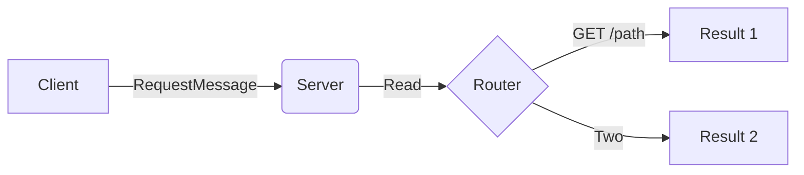
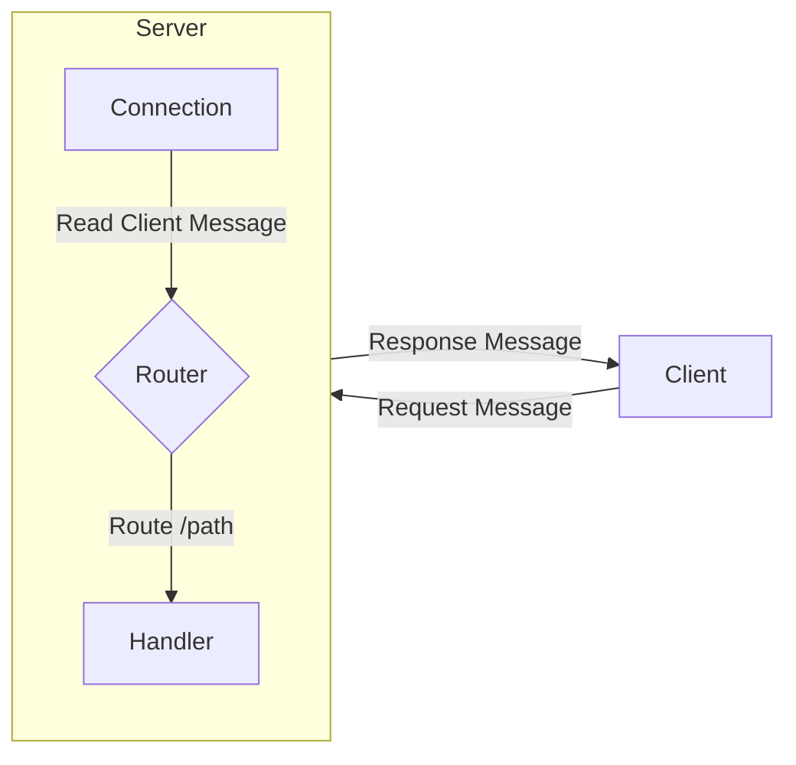
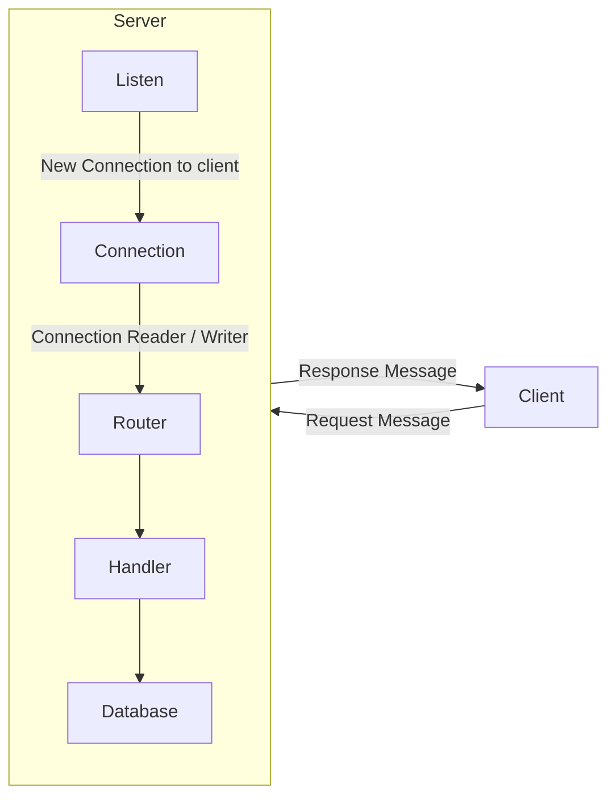
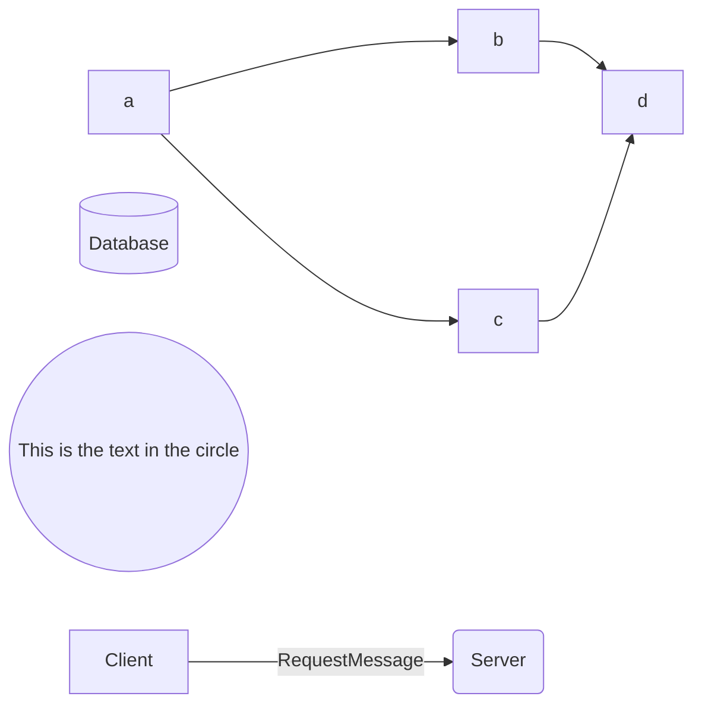
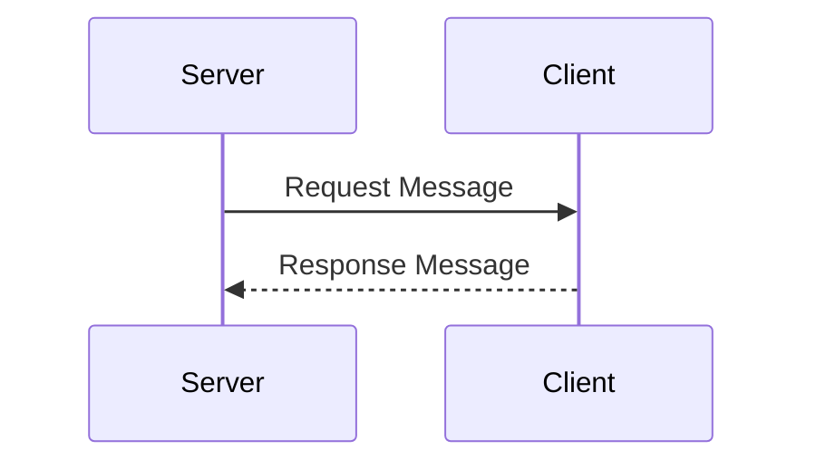

# GO TCP Client-Server
// Message -> Connection -> Read -> Parse -> Request -> Route -> Handler -> Response -> Write -> Connection -> Message

## A


## B


## C



## D




## Server-Client Sequence


## HTTP Message Format

An HTTP message consists of a start-line, headers, and a body, separated by CRLF (\r\n) sequences. The body of the message, also known as the payload, comes after the headers and is optional.

Here's a basic format of an HTTP request message with a body:

```
POST /path HTTP/1.1\r\n
Host: www.example.com\r\n
Content-Type: application/x-www-form-urlencoded\r\n
Content-Length: length\r\n
\r\n
field1=value1&field2=value2
```

    - The start-line is POST /path HTTP/1.1 and indicates this is a POST request to the /path resource.
    - The Host header is required in HTTP/1.1 and specifies the domain of the server.
    - The Content-Type header indicates the media type of the body. In this case, it's application/x-www-form-urlencoded, which is commonly used when submitting HTML forms.
    - The Content-Length header indicates the length of the body in bytes.
    - After the headers, there's an empty line (\r\n), which indicates the end of the headers and the start of the body.
    - The body is field1=value1&field2=value2, which is a URL-encoded form data.

For a JSON payload, the Content-Type would be application/json and the body would contain a JSON object:

```
POST /path HTTP/1.1\r\n
Host: www.example.com\r\n
Content-Type: application/json\r\n
Content-Length: length\r\n
\r\n
{"field1":"value1","field2":"value2"}
```# go-net
