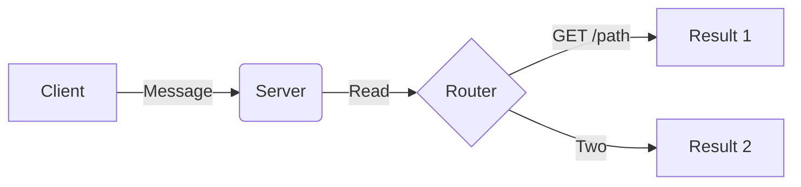
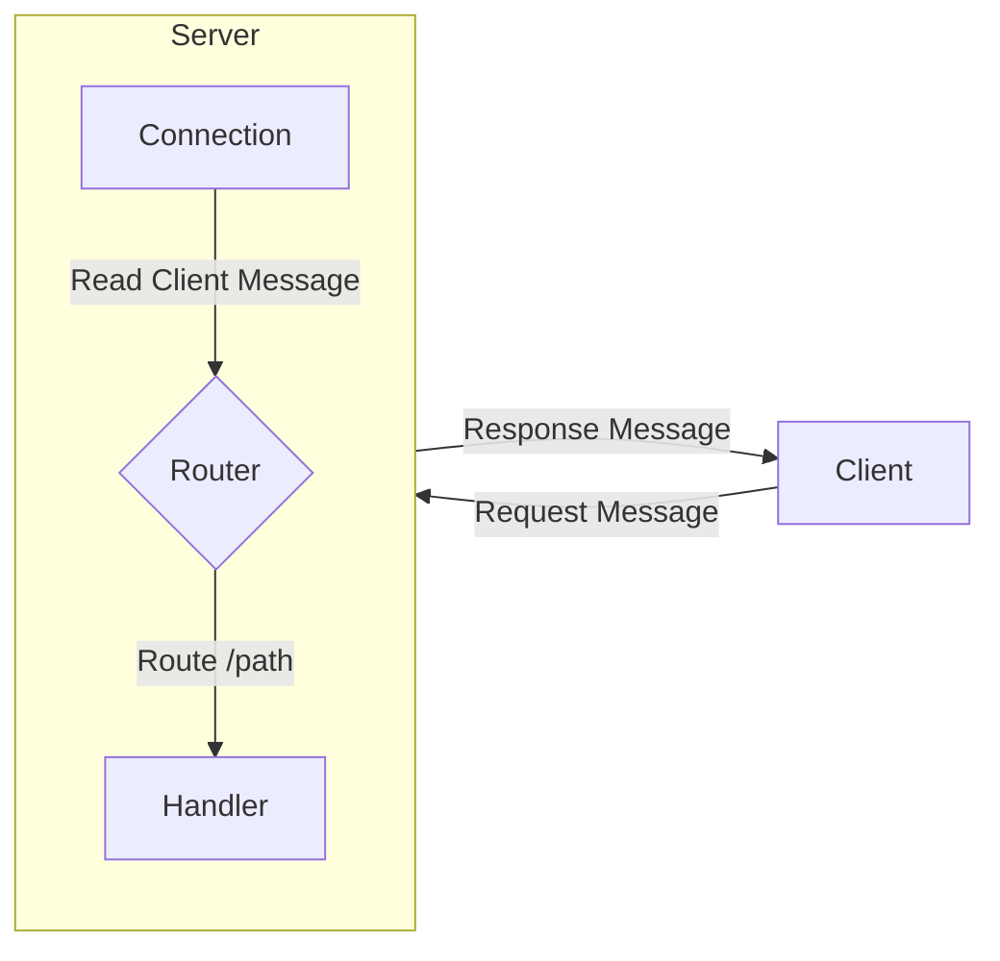
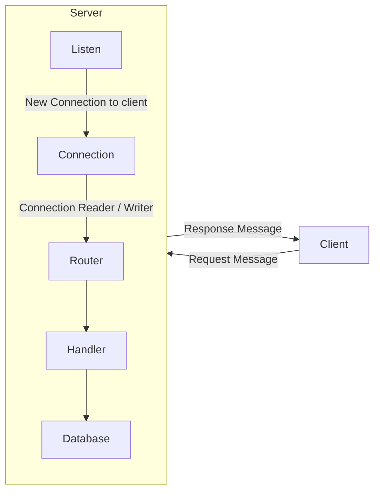
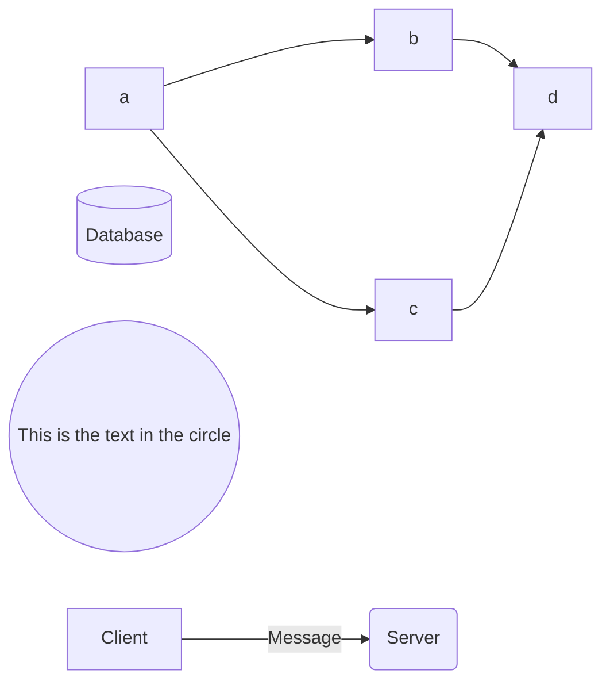
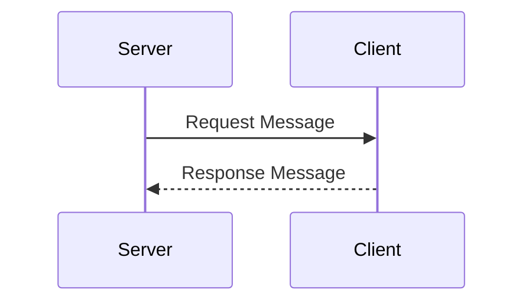

# Diagrams

## Stream

bytes -> NewBuffer(bytes) -> NewReader(buffer) -> HandleRead(reader)

## Connection
// Message -> Connection -> Read -> Parse -> Request -> Route -> Handler -> Response -> Write -> Connection -> Message

## A

## B

## C

## D

## Server-Client Sequence

